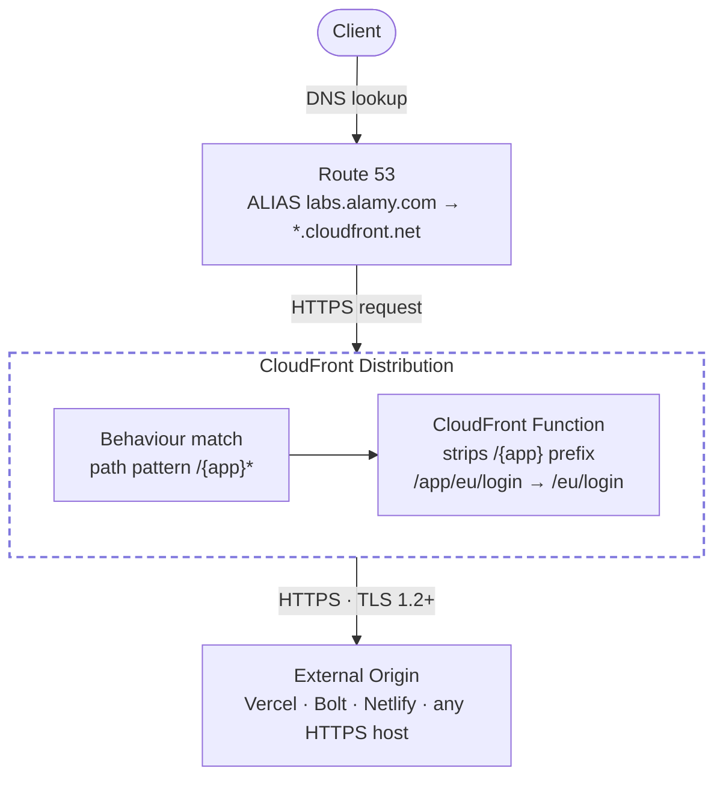

# ADR-0002: CloudFront Reverse Proxy Architecture

## Status

Accepted — 2026-04-14

## Context

PMs and designers build proof-of-concept applications on external platforms (Vercel, Bolt, etc.). These POCs are accessible under platform-owned domains, which does not present a consistent Alamy brand experience when sharing with stakeholders.

The requirement is to serve these applications under a vanity URL pattern:

```
https://labs.alamy.com/{app}/*  →  https://{origin_domain}/*
```

without migrating the applications onto Alamy infrastructure.

## Decision

Use a single CloudFront distribution as a reverse proxy with path-based routing.

### Request flow



1. Route 53 resolves `labs.alamy.com` to the CloudFront distribution via an ALIAS record.
2. CloudFront matches the incoming path against a per-application behaviour (`/{app}/*`).
3. A CloudFront Function fires on `viewer-request` and strips the `/{app}` segment so the origin receives a clean path (e.g. `/eu/login` instead of `/myapp/eu/login`).
4. The request is forwarded to the external origin over HTTPS. CloudFront sends the origin's own domain as the `Host` header, which is required by platforms like Vercel and Bolt to identify the correct project.

### Key configuration decisions

| Concern | Decision | Reason |
| --- | --- | --- |
| Path rewriting | CloudFront Function (JS) | Lightweight, no cold start, executes at edge |
| Host header | Origin domain (not viewer) | External platforms route by Host header |
| Caching | Disabled (TTL = 0) | POC apps change frequently; origins stay authoritative |
| TLS — viewer | TLSv1.2 minimum (`TLSv1.2_2021`) | Security baseline; TLS 1.3 negotiated automatically |
| TLS — origin | TLSv1.2 only | Consistent end-to-end encryption standard |
| HTTP → HTTPS | `redirect-to-https` | Transparent redirect rather than hard rejection |
| IPv6 | Enabled | A + AAAA ALIAS records cover both stacks |
| DNS | Route 53 ALIAS (not CNAME) | No extra DNS hop; free queries to CloudFront |
| Certificate | ACM DNS-validated in us-east-1 | CloudFront requirement |

### Adding a new application

Add one entry to `labs_applications` in the relevant workspace tfvars:

```hcl
labs_applications = {
  myapp = { origin_domain = "myapp.vercel.app" }
}
```

A new CloudFront origin and behaviour are created automatically on the next deployment. No code changes are required.

## Alternatives considered

| Alternative | Why rejected |
| --- | --- |
| API Gateway HTTP proxy | Higher latency, more complex routing config, no edge caching option |
| Lambda@Edge for path rewriting | Heavier than a CloudFront Function; cold starts; higher cost |
| Separate CloudFront distribution per app | Operational overhead; certificate and DNS sprawl |
| CNAME instead of ALIAS | Extra DNS hop; Route 53 charges per query |

## Consequences

- Adding or removing a POC application is a one-line tfvars change.
- The external application has no awareness of the `labs.alamy.com` domain — it receives requests as if called directly.
- If an external platform requires the viewer's `Host` header (e.g. for redirect generation), a custom header or Lambda@Edge would be needed.
- Caching can be enabled per-application once it stabilises by introducing a dedicated cache policy.
