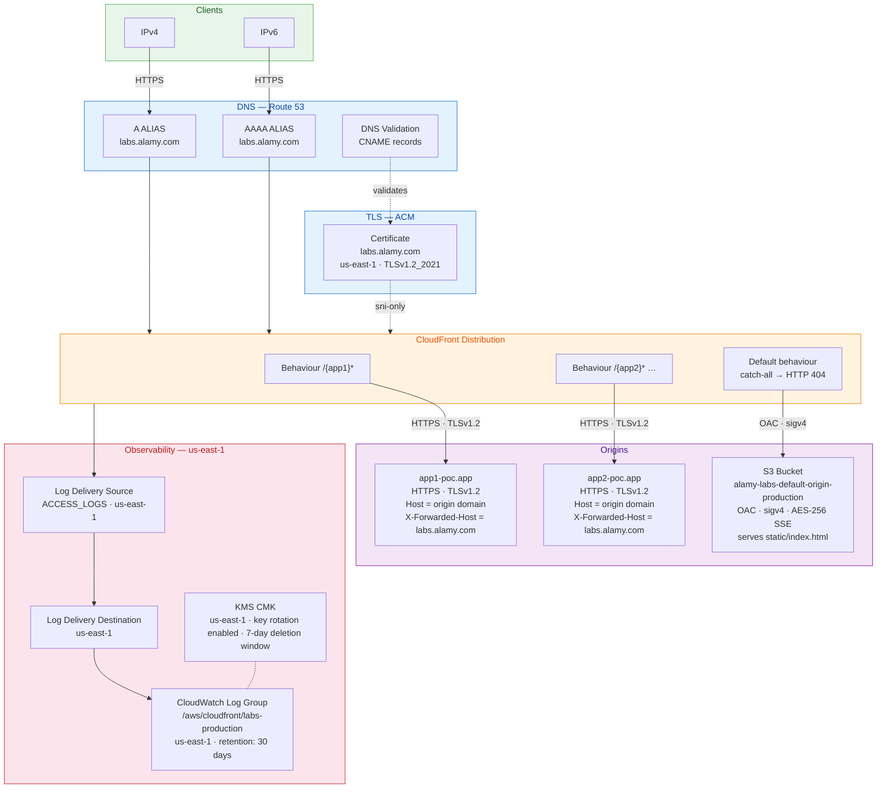

# ADR-0002: CloudFront Reverse Proxy Architecture

## Status

Accepted — 2026-04-14  
Updated — 2026-04-22 (Default origin changed from external hostname to S3 bucket with OAC; WAF status and `.trivyignore` rationale retained)

---

## Context

Applications built on external platforms (Vercel, Bolt, etc.) are accessible under platform-owned domains. The requirement is to serve them under a consistent Alamy vanity URL without migrating onto Alamy infrastructure:

```
https://labs.alamy.com/{app}/*  →  https://{origin_domain}/{app}/*
```

Unmatched paths must return a controlled holding page rather than forwarding to an arbitrary external host.

---

## Decision

Single CloudFront distribution acting as a reverse proxy with path-based routing. The default (catch-all) behaviour is backed by an S3 bucket with Origin Access Control, serving a branded 404 holding page.

### Request flow



1. Route 53 resolves `labs.alamy.com` to the CloudFront distribution via A + AAAA ALIAS records.
2. CloudFront evaluates ordered cache behaviours, matching the request path against `/{app}/*`.
3. The request is forwarded over HTTPS to the external origin with the origin's own domain as `Host` (required by Vercel, Bolt, and similar platforms). `X-Forwarded-Host` carries `labs.alamy.com`. The full path is forwarded intact.
4. Unmatched paths fall through to the default behaviour, which reads `index.html` from the S3 bucket via OAC and returns HTTP 404. S3 `403` responses (raised when public access is blocked and the object is missing) are also mapped to `index.html` / 404 via CloudFront custom error responses.
5. Access logs are delivered to CloudWatch Logs via the Standard Logging v2 delivery chain.

### CloudFront configuration

| Concern | Value | Reason |
|---|---|---|
| HTTP version | `http2and3` | H2 + H3 support |
| Viewer protocol | `redirect-to-https` | Transparent redirect |
| Viewer TLS minimum | `TLSv1.2_2021` | Security baseline; TLS 1.3 negotiated automatically |
| Origin protocol (app) | `https-only` | Encrypted end-to-end |
| Origin TLS (app) | `TLSv1.2` | Consistent with viewer baseline |
| Origin protocol (default) | OAC sigv4 → S3 | No credentials in URL; S3 access via signed requests |
| Host header | Origin domain | External platforms route by Host |
| Forwarded headers | `Origin`, `Access-Control-Request-Headers`, `Access-Control-Request-Method`, `CloudFront-Viewer-Address` | CORS support |
| Cookies | All forwarded | Session continuity |
| Query strings | All forwarded | Passthrough |
| Caching | Disabled (TTL = 0) | Origins remain authoritative |
| Compression | Enabled | Gzip/Brotli at edge |
| IPv6 | Enabled | A + AAAA ALIAS records |
| Price class | `PriceClass_100` (production) | US + EU edge locations |
| Connection attempts | 3 | Origin retry |
| Connection timeout | 10 s | |
| Read timeout | 60 s (default origin), 30 s (app origins) | |
| Default origin | S3 bucket + OAC | Controlled holding page; no risk of forwarding to unexpected external host |
| Geo restriction | None | |
| WAF | Not attached (`AVD-AWS-0011` suppressed) | Distribution is a POC proxy with no user-submitted input and no sensitive data. Trivy finding suppressed in `.trivyignore`. WAF must be attached before any application that accepts user input or handles sensitive data is added. |

### Origin request policy

Custom policy `alamy-labs-external-origin-policy`:

- Cookies: all
- Headers: `Origin`, `Access-Control-Request-Headers`, `Access-Control-Request-Method`, `CloudFront-Viewer-Address`
- Query strings: all

Applied to app behaviour origins only. The default S3 origin uses managed caching with no forwarding.

### Cache policy

Custom policy `alamy-labs-no-cache` with `default_ttl = max_ttl = min_ttl = 0`. Accept-Encoding normalisation disabled. Applied to all behaviours.

### Default origin — S3 with OAC

The default behaviour is backed by an S3 bucket rather than an external hostname. This removes the dependency on an always-available external host for unmatched paths and eliminates the `default_origin_domain` input variable.

- Bucket: `alamy-labs-default-origin-{workspace}` (AES-256 SSE, versioning enabled, public access fully blocked)
- Access: CloudFront Origin Access Control (`sigv4`, `always` signing); S3 bucket policy scoped to this distribution ARN
- Content: `static/index.html` uploaded as an S3 object, tracked by `etag` for change detection
- Error mapping: CloudFront custom error responses map S3 `403` → HTTP 404 / `index.html` and S3 `404` → HTTP 404 / `index.html` (both with `error_caching_min_ttl = 0`)

### Adding an application

Add one entry to `labs_applications` in the workspace tfvars and raise a PR:

```hcl
labs_applications = {
  myapp = { origin_domain = "myapp.vercel.app" }
}
```

A new CloudFront origin (`labs-app-{key}`) and ordered cache behaviour (`/{key}*`) are created automatically. No code changes required.

## Alternatives considered

| Alternative | Reason rejected |
|---|---|
| API Gateway HTTP proxy | Higher latency, more complex routing, no edge caching path |
| Lambda@Edge path rewriting | Cold starts, higher cost, heavier runtime |
| One CloudFront distribution per app | Certificate and DNS sprawl, operational overhead |
| CNAME instead of ALIAS | Extra DNS hop; Route 53 charges per query |
| S3 for access logs | No CMK support for CloudFront Standard Logging v2 delivery |
| External hostname as default origin | Requires an always-available external host; risk of forwarding unmatched paths to arbitrary hosts; harder to control 404 page content |

---

## Consequences

- Adding or removing an application is a one-line tfvars change followed by a PR.
- External origins receive requests as if called directly; they have no awareness of `labs.alamy.com`.
- If an origin requires the viewer `Host` header for redirect generation, a custom header or Lambda@Edge rewrite is needed.
- Caching can be enabled per application by attaching a dedicated cache policy once the application stabilises.
- The `static/index.html` file must exist in the repository at `terraform/static/index.html`. The `filemd5()` call in `s3.tf` will fail at plan time if it is absent.
- WAF (`AVD-AWS-0011`) is intentionally not attached. The distribution serves POC applications with no user-submitted input and no sensitive data. The Trivy finding is suppressed in `.trivyignore`. WAF must be re-evaluated and attached before any application that accepts user input or handles sensitive data goes live.
